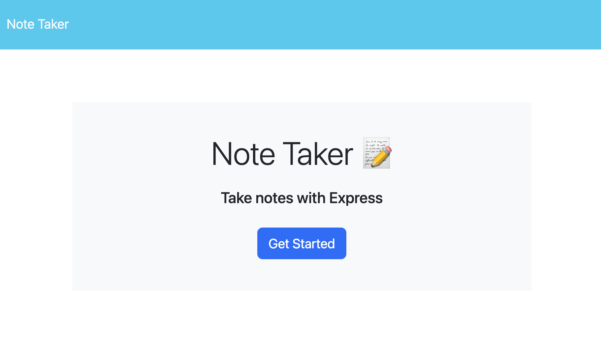

# note-buddy

## Description: 
This note-taker app allows the user to write and save notes. It uses Express.js on the back end and saves the notes in a db.json file, and allows the user to retrieve the saved notes at a later date. 

## Table of Contents
1. [Description](#description)
2. [Usage](#usage)
3. [Credits](#credits)
4. [License](#license)
5. [Contact](#contact)

## Usage
To use: copy code to local code editor. Run 'node server.js' in terminal to use on localhost:3001.

Heroku link: 
> https://note-buddy-71f65bff652e.herokuapp.com/

## Credits
apiRoutes.js - lines 34-41 are credited to: https://www.tabnine.com/code/javascript/functions/express/Express/delete

## License
MIT License - see https://opensource.org/licenses/ to get more information about this license.

## Contact
🔍Find me at (https://github.com/bentwhiskers) on GitHub.

 Email me at abbott1414@gmail.com for further questions.